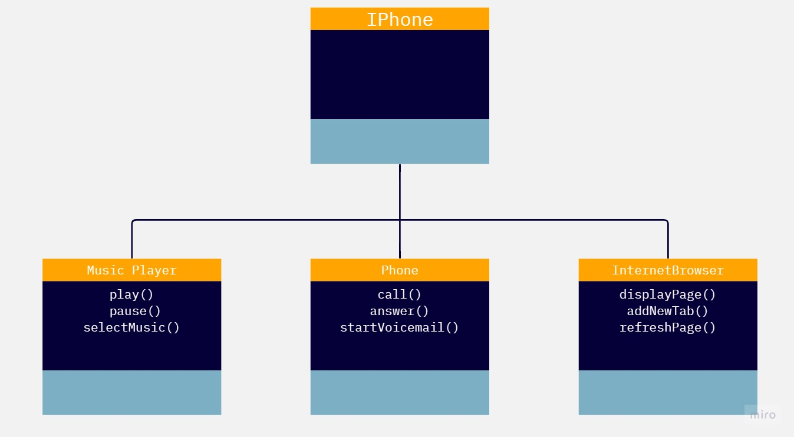

# iPhone Study Challenge

This repository contains the code and documentation for the iPhone Study Challenge. The goal of this challenge was to model and implement the roles of an iPhone as a Music Player, Phone, and Internet Browser using UML diagrams and Java programming language.

## Project Structure

The project is organized into the following files and folders:

- MusicPlayer.java: This file contains the MusicPlayer interface, which declares methods for playing, pausing, and selecting music.

- Phone.java: This file contains the Phone interface, which declares methods for making a call, answering a call, and starting voicemail.

- InternetBrowser.java: This file contains the InternetBrowser interface, which declares methods for displaying a webpage, adding a new tab, and refreshing the page.

- IPhone.java: This file contains the implementation class, IPhone, which implements all three interfaces (MusicPlayer, Phone, and InternetBrowser). It provides the actual implementation for each method declared in the interfaces.

## UML Diagram

The UML diagram above provides a simple example of how to use object-oriented programming principles and create a UML diagram. It illustrates the relationships between the different roles of an iPhone, including the Music Player, Phone, and Internet Browser.

## Lessons Learned

Through this study challenge, several key lessons were learned:

1. UML Diagrams: The importance of UML diagrams in visualizing and representing the structure and behavior of a system. The UML diagram helped in understanding the relationships between the different roles of an iPhone and provided a blueprint for the implementation.

2. Interface-based Design: The use of interfaces to define contracts and separate the declaration of methods from their implementation. This approach allows for flexibility and modularity, enabling different classes to implement the same interface and providing a clear separation of concerns.

3. Object-Oriented Programming: The application of object-oriented programming principles, such as encapsulation, inheritance, and polymorphism, in designing and implementing the iPhone roles. This approach promotes code reusability, maintainability, and extensibility.

4. Code Organization: The importance of organizing code into separate files and following naming conventions. By creating separate files for each class and interface, the codebase becomes more organized, readable, and easier to maintain.

## Challenge Link

For more details about the challenge, please visit the [iPhone Study Challenge](https://github.com/digitalinnovationone/trilha-java-basico/blob/main/desafios/poo/README.md) on the Digital Innovation One repository.

